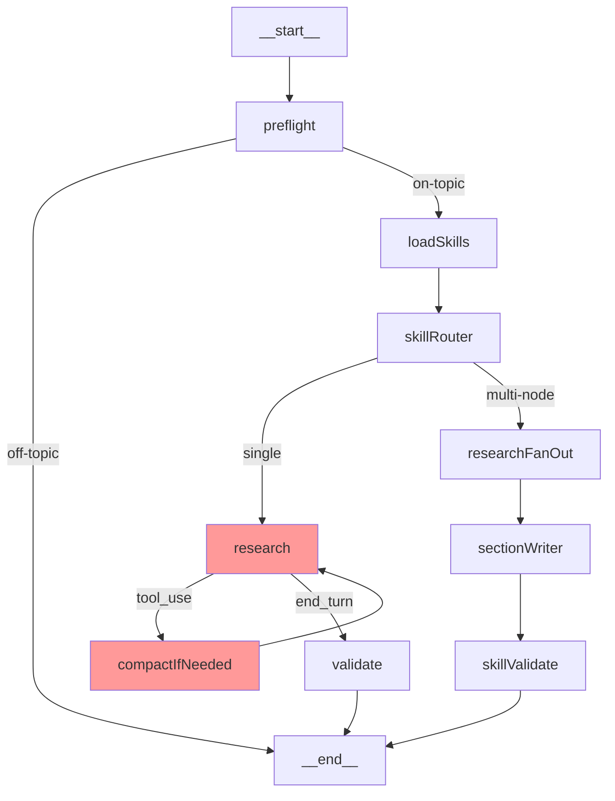
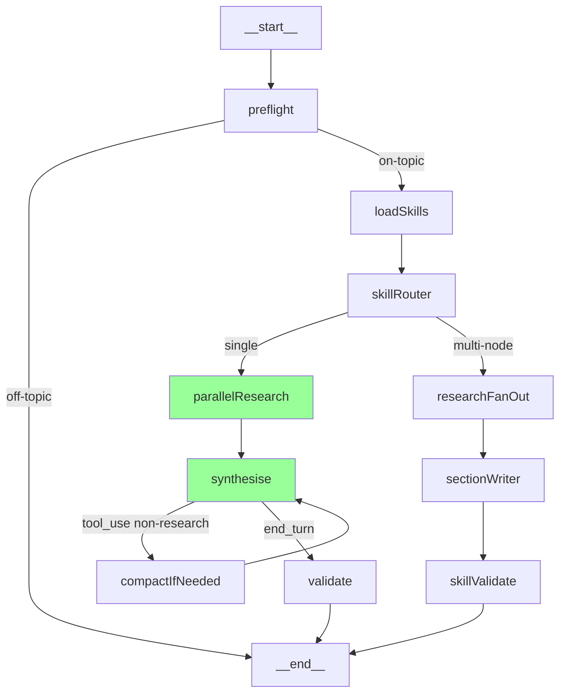
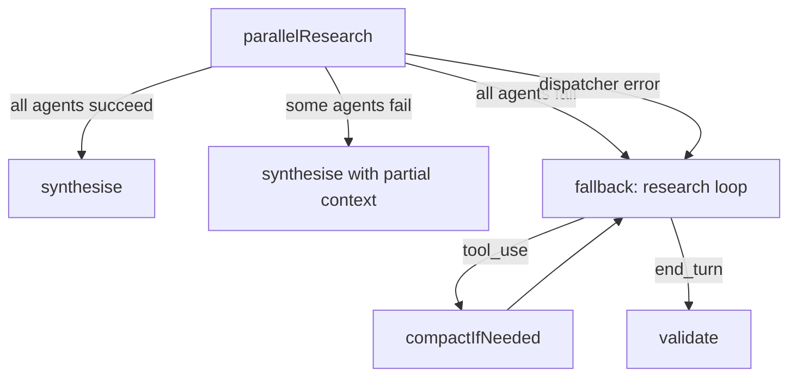

# Design Document — Parallel Research Agents

## Overview

This design replaces the sequential Sonnet-driven research loop in `src/graph.js` with a parallel research architecture using domain-specific Haiku sub-agents. The current flow — `research → compactIfNeeded → research` (repeating 4–6 times per request) — sends the full system prompt, conversation history, and all tool definitions to Sonnet on every turn. The new architecture introduces a **Research Dispatcher** that spawns lightweight Haiku agents in parallel, each scoped to a single tool domain (Jira, Confluence, Docs, Web). These agents independently make multi-turn tool calls, return structured summaries, and hand off to a single Sonnet synthesis call.

The key changes are:
1. **New `src/researchAgents.js` module** — contains `runResearchAgent()` (multi-turn Haiku tool-calling loop), domain-specific system prompts, Research Summary schema validation, and the `dispatchResearch()` orchestrator.
2. **Modified `src/graph.js`** — replaces the `research → compactIfNeeded` loop with a `parallelResearch → synthesise` path for single-mode execution. The multi-node path (`researchFanOut → sectionWriter → skillValidate`) is untouched.
3. **Extended `src/subAgent.js`** — new `runToolAgent()` function that supports multi-turn tool-calling loops (the existing `runSubAgent()` remains unchanged for single-shot calls).
4. **Modified `src/skillLoader.js`** — `loadSkillsForProblem()` accepts classification type and conditionally loads `cr-evaluator` instead of always loading it.
5. **Modified `skills/registry.json`** — `cr-evaluator.alwaysLoad` set to `false`.

The multi-node document generation path is completely preserved. The existing tool definitions and handlers in `src/tools/` are unchanged — Research Agents call the same `handle()` function.

---

## Architecture

### Current Flow (Sequential Research)



In the current flow, the `research` node makes a streaming Sonnet call with all tools. When Sonnet requests tool use, the graph executes the tools, appends results, runs compaction, and loops back to `research`. This repeats 4–6 times per request, each time sending the full context to Sonnet.

### New Flow (Parallel Research)



The new flow replaces the `research → compactIfNeeded` loop with:
1. **`parallelResearch`** — dispatches domain-specific Haiku agents in parallel, collects Research Summaries, assembles them into a context block.
2. **`synthesise`** — single streaming Sonnet call with assembled research context. Still supports tool-use for non-research tools (plans, skills, history). If Sonnet requests a research tool, it executes normally as a fallback.

### Graceful Degradation Flow



When all Research Agents fail or the dispatcher throws, the graph falls back to the existing sequential `research → compactIfNeeded` loop. This preserves the current behaviour as a safety net.

---

## Components and Interfaces

### 1. `runToolAgent()` — New function in `src/subAgent.js`

The existing `runSubAgent()` makes a single non-streaming Anthropic call with no tool support. The new `runToolAgent()` supports multi-turn tool-calling loops for Research Agents.

```javascript
/**
 * Runs a multi-turn tool-calling Haiku agent.
 * Loops until the model stops requesting tools or maxTurns is reached.
 *
 * @param {object} opts
 * @param {string} opts.systemPrompt - Domain-specific system prompt
 * @param {string} opts.userContent - The user's query / problem text
 * @param {Array} opts.tools - Anthropic tool definitions (subset for this domain)
 * @param {Function} opts.handle - Tool handler function from src/tools/index.js
 * @param {string} [opts.model] - Model ID (default: claude-haiku-4-5-20251001)
 * @param {number} [opts.maxTokens] - Max output tokens per turn (default: 1024)
 * @param {number} [opts.maxTurns] - Max tool-call turns (default: 5)
 * @param {string} [opts.operation] - Label for logging
 * @param {Function} [opts.onToolCall] - Callback for each tool call (name, input)
 * @returns {Promise<string>} - Final text response from the agent
 */
export async function runToolAgent({
  systemPrompt,
  userContent,
  tools,
  handle,
  model = 'claude-haiku-4-5-20251001',
  maxTokens = 1024,
  maxTurns = 5,
  operation = 'unknown',
  onToolCall = null,
})
```

**Execution model:**
1. Build initial messages: `[{ role: 'user', content: userContent }]`
2. Call `client.messages.create({ model, max_tokens, system, messages, tools })`
3. If `stop_reason === 'tool_use'`:
   - Extract tool-use blocks from response content
   - Execute each via `handle(name, input)` — log at `[research:<domain>]`
   - Append assistant message + tool results to messages
   - Increment turn counter; if `< maxTurns`, loop to step 2
4. If `stop_reason === 'end_turn'` or max turns reached:
   - Extract final text block from response content
   - Return the text

This function does NOT stream — Research Agents run in the background and return their final text to the dispatcher.

### 2. `src/researchAgents.js` — New module

Contains the Research Dispatcher, domain-specific system prompts, and Research Summary validation.

```javascript
// ─── Domain Tool Mapping ──────────────────────────────────────────────────────

export const DOMAIN_TOOLS = {
  jira:       ['search_jira', 'get_jira_ticket', 'add_jira_comment'],
  confluence: ['search_confluence', 'get_confluence_page'],
  kapa_docs:  ['search_kapa_docs', 'search_docs_site'],
  web_search: ['search_docs_site'],
};

// ─── Domain System Prompts ────────────────────────────────────────────────────

export const DOMAIN_PROMPTS = {
  jira: `You are a Jira research agent...`,       // See Requirement 6
  confluence: `You are a Confluence research agent...`,
  kapa_docs: `You are a documentation research agent...`,
  web_search: `You are a web search research agent...`,
};

// ─── Research Summary Validation ──────────────────────────────────────────────

/**
 * Validates a Research Summary against the expected schema.
 * Returns { valid: true, summary } or { valid: false, summary: errorWrapped }.
 *
 * @param {string} rawOutput - Raw text output from the Research Agent
 * @param {string} domain - The domain this agent was researching
 * @returns {{ valid: boolean, summary: ResearchSummary }}
 */
export function validateResearchSummary(rawOutput, domain)

// ─── Research Dispatcher ──────────────────────────────────────────────────────

/**
 * Dispatches parallel Research Agents based on tool tags from preflight.
 * Returns assembled Research Summaries.
 *
 * @param {object} opts
 * @param {string[]} opts.toolTags - Tool category tags from preflight
 * @param {string} opts.problemText - The user's query
 * @param {string} opts.userId - For tool handler context
 * @param {number} [opts.timeoutMs] - Per-agent timeout (default: RESEARCH_AGENT_TIMEOUT_MS)
 * @param {number} [opts.maxTurns] - Per-agent max turns (default: RESEARCH_AGENT_MAX_TURNS)
 * @param {Function} [opts.onToolStatus] - SSE callback
 * @returns {Promise<{ summaries: ResearchSummary[], allFailed: boolean }>}
 */
export async function dispatchResearch(opts)
```

**Dispatcher execution:**
1. Filter `toolTags` to research-relevant tags: `jira`, `confluence`, `kapa_docs`, `web_search`
2. For each tag, get tool definitions from `getToolsByIntent([tag], context)` filtered to `DOMAIN_TOOLS[tag]`
3. Spawn `runToolAgent()` for each domain in parallel via `Promise.allSettled()`
4. Wrap each call with `Promise.race()` against the timeout
5. Validate each result with `validateResearchSummary()`
6. Return `{ summaries, allFailed }`

### 3. Modified Graph Nodes in `src/graph.js`

#### New Node: `parallelResearch`

Replaces the entry point for single-mode research. Calls `dispatchResearch()` and assembles the context block.

```javascript
const parallelResearchNode = maybeTraceable('parallelResearch', async (state) => {
  // 1. Emit research phase
  await onPhase?.('research');
  await onStatus('🔍 Researching in parallel...');

  // 2. Dispatch parallel agents
  const { summaries, allFailed } = await dispatchResearch({
    toolTags: state.toolTags,
    problemText: state.problemText,
    userId: state.userId,
    onToolStatus,
  });

  // 3. If all failed, fall back to sequential research
  if (allFailed) {
    return { researchContext: '', fallbackToSequential: true };
  }

  // 4. Assemble research context block
  const researchContext = assembleResearchContext(summaries);

  // 5. Emit synthesise phase
  await onPhase?.('synthesise');
  await onStatus('✍️ Synthesising...');

  return { researchContext, fallbackToSequential: false };
});
```

#### New Node: `synthesise`

Single streaming Sonnet call with assembled research context. Supports tool-use loop for non-research tools.

```javascript
const synthesiseNode = maybeTraceable('synthesise', async (state) => {
  // Inject research context into messages
  const researchMessage = {
    role: 'user',
    content: `[Research Results]\n\n${state.researchContext}`,
  };
  const messages = [...state.messages, researchMessage];

  // Streaming Sonnet call with tool support (plans, skills, history, + research fallback)
  // Same streaming logic as current research node, but starts with research context pre-loaded
  // ...
});
```

#### Modified Wiring

```javascript
// Replace: skillRouter → research (single mode)
// With:    skillRouter → parallelResearch → conditional → synthesise or research (fallback)

graph.addConditionalEdges('skillRouter', (state) => {
  return state.executionMode === 'multi-node' ? 'researchFanOut' : 'parallelResearch';
});

graph.addConditionalEdges('parallelResearch', (state) => {
  return state.fallbackToSequential ? 'research' : 'synthesise';
});

graph.addConditionalEdges('synthesise', (state) => {
  if (state.stopReason === 'tool_use' && state.turnCount < MAX_TURNS) return 'compactIfNeeded';
  return 'validate';
});

graph.addEdge('compactIfNeeded', 'synthesise');  // Changed from → research
```

### 4. Modified `src/skillLoader.js`

The `loadSkillsForProblem()` function gains a `classificationType` parameter:

```javascript
export async function loadSkillsForProblem(problemText, semanticMatches = null, classificationType = null) {
  const registry = getRegistry();

  // cr-evaluator conditional loading:
  // Load if classificationType is 'cr', 'brd', 'issue', or if classificationType is null (fallback)
  const crRelevantTypes = new Set(['cr', 'brd', 'issue']);
  const shouldLoadCr = classificationType === null || crRelevantTypes.has(classificationType);

  const alwaysOn = registry.skills
    .filter(s => s.alwaysLoad)
    .map(s => ({ ...s, matchedTriggers: [], alwaysActive: true }));

  // Conditionally add cr-evaluator if not alwaysLoad but classification warrants it
  if (shouldLoadCr) {
    const crSkill = registry.skills.find(s => s.id === 'cr-evaluator');
    if (crSkill && !crSkill.alwaysLoad && !alwaysOn.some(s => s.id === 'cr-evaluator')) {
      alwaysOn.push({ ...crSkill, matchedTriggers: [], alwaysActive: true, conditionalLoad: true });
    }
  }

  // ... rest unchanged
}
```

### 5. Modified `skills/registry.json`

```json
{
  "id": "cr-evaluator",
  "folder": "cr-evaluator",
  "description": "CS feasibility evaluation rubric — loaded for CR/BRD/issue requests",
  "alwaysLoad": false,
  "triggers": ["cr", "change request", "feasibility", "brd"]
}
```

### 6. `assembleResearchContext()` — Helper in `src/researchAgents.js`

Formats Research Summaries into a delimited context block for the Synthesis Phase:

```javascript
/**
 * Assembles Research Summaries into a formatted context block.
 *
 * @param {ResearchSummary[]} summaries
 * @returns {string} Formatted context block
 */
export function assembleResearchContext(summaries) {
  return summaries
    .filter(s => s.status !== 'error')
    .map(s => {
      const header = `### ${s.domain.toUpperCase()} Research (${s.status})`;
      const findings = s.findings
        .map(f => `- **${f.title}**: ${f.summary}${f.url ? ` ([source](${f.url}))` : ''}`)
        .join('\n');
      const note = s.relevanceNote ? `\n_Relevance: ${s.relevanceNote}_` : '';
      return `${header}\n${findings}${note}`;
    })
    .join('\n\n---\n\n');
}
```

---

## Data Models

### Research Summary Schema

```typescript
interface ResearchSummary {
  /** Tool domain: "jira" | "confluence" | "kapa_docs" | "web_search" */
  domain: string;

  /** Completion status */
  status: "complete" | "partial" | "error";

  /** Key findings, max 5 entries */
  findings: Array<{
    /** Short title for the finding */
    title: string;
    /** Summary of the finding, max 100 words */
    summary: string;
    /** Source URL or null */
    url: string | null;
  }>;

  /** One-sentence relevance assessment */
  relevanceNote: string;

  /** Number of tool calls made by this agent */
  toolCallCount: number;

  /** Wall-clock duration in milliseconds */
  durationMs: number;

  /** Error descriptions (present when status is "partial" or "error") */
  errors?: string[];
}
```

### New Graph State Channels

```javascript
// Added to the StateGraph channels in graph.js:
researchContext:       { value: (_, n) => n ?? '', default: () => '' },
fallbackToSequential:  { value: (_, n) => n ?? false, default: () => false },
researchSummaries:     { value: (_, n) => n ?? [], default: () => [] },
```

### Domain Tool Mapping

```javascript
// Maps each research domain to its allowed tool names
const DOMAIN_TOOLS = {
  jira:       ['search_jira', 'get_jira_ticket', 'add_jira_comment'],
  confluence: ['search_confluence', 'get_confluence_page'],
  kapa_docs:  ['search_kapa_docs', 'search_docs_site'],
  web_search: ['search_docs_site'],
};
```

### Environment Variables

| Variable | Default | Description |
|---|---|---|
| `RESEARCH_AGENT_TIMEOUT_MS` | `15000` | Per-agent timeout in milliseconds |
| `RESEARCH_AGENT_MAX_TURNS` | `5` | Max tool-call turns per Research Agent |


---

## Correctness Properties

*A property is a characteristic or behavior that should hold true across all valid executions of a system — essentially, a formal statement about what the system should do. Properties serve as the bridge between human-readable specifications and machine-verifiable correctness guarantees.*

The following properties were derived from the acceptance criteria prework analysis. Criteria related to SSE events, logging, architectural constraints, and performance were classified as EXAMPLE, INTEGRATION, or non-testable and are covered by unit/integration tests in the Testing Strategy section. The properties below focus on the core logic that benefits from property-based testing with randomized inputs.

### Property 1: Dispatcher spawns one agent per research-relevant tool tag

*For any* non-empty subset of valid tool tags (`jira`, `confluence`, `kapa_docs`, `web_search`), `dispatchResearch()` SHALL spawn exactly one Research Agent per tag, and the number of agents spawned SHALL equal the number of research-relevant tags in the input.

**Validates: Requirements 1.1**

### Property 2: Domain tool isolation

*For any* research domain, the tool definitions passed to `runToolAgent()` SHALL contain exactly the tools listed in `DOMAIN_TOOLS[domain]` and no others. A Jira agent SHALL never receive Confluence tools, and vice versa.

**Validates: Requirements 1.2, 2.3**

### Property 3: Research Summary schema round-trip

*For any* valid `ResearchSummary` object (with `domain` as a string, `status` as one of `"complete" | "partial" | "error"`, `findings` as an array of 0–5 entries each with `title`, `summary` ≤ 100 words, and `url` as string or null, `relevanceNote` as a string, `toolCallCount` as a non-negative integer, and `durationMs` as a non-negative integer), serializing to JSON and then passing through `validateResearchSummary()` SHALL return `{ valid: true }` with the original summary preserved.

**Validates: Requirements 2.6, 3.1, 3.5, 3.6**

### Property 4: Invalid output wrapping

*For any* string that is not valid JSON or does not conform to the `ResearchSummary` schema, `validateResearchSummary(rawOutput, domain)` SHALL return `{ valid: false }` with a summary that has `status: "error"`, an empty `findings` array, and the domain field set to the provided domain.

**Validates: Requirements 3.8**

### Property 5: Research context assembly preserves all non-error findings

*For any* array of `ResearchSummary` objects, `assembleResearchContext(summaries)` SHALL include every finding from every summary whose status is not `"error"`, and SHALL exclude all findings from summaries with `status: "error"`. The output string SHALL contain the title of each included finding.

**Validates: Requirements 1.4, 4.3**

### Property 6: Conditional cr-evaluator loading by classification type

*For any* classification type in `{ "cr", "brd", "issue" }`, `loadSkillsForProblem(text, matches, classificationType)` SHALL include `cr-evaluator` in the returned `skillIds`. *For any* classification type equal to `"general_query"`, `loadSkillsForProblem()` SHALL NOT include `cr-evaluator` in the returned `skillIds`. When `classificationType` is `null` (fallback), `cr-evaluator` SHALL be included.

**Validates: Requirements 5.2, 5.3, 5.5**

### Property 7: Failure detection correctness

*For any* array of `ResearchSummary` objects, `dispatchResearch()` SHALL return `allFailed: true` if and only if every summary in the array has `status: "error"`. If at least one summary has `status: "complete"` or `"partial"`, `allFailed` SHALL be `false`.

**Validates: Requirements 7.1, 7.2**

### Property 8: Max turns enforcement

*For any* `maxTurns` value between 1 and 10, `runToolAgent()` SHALL make at most `maxTurns` API calls when the model continuously requests tool use. After `maxTurns` calls, the agent SHALL return whatever text content is available, even if the model's last response was a tool-use request.

**Validates: Requirements 2.4**

### Property 9: Timeout enforcement

*For any* timeout value `T` and any Research Agent that takes longer than `T` milliseconds, the dispatcher SHALL resolve that agent's promise within `T + 100ms` (allowing for event loop overhead), returning either partial results or an error-status summary.

**Validates: Requirements 1.3**

---

## Error Handling

### Research Agent Errors

| Error Scenario | Handling | User Impact |
|---|---|---|
| Single tool call fails within an agent | Agent continues with remaining tools; summary has `status: "partial"` with `errors` array | Synthesis receives partial findings; response may note missing sources |
| All tool calls fail within an agent | Agent returns `status: "error"` with empty findings | Other agents' results still used; failed domain noted in context |
| Agent exceeds timeout | `Promise.race()` resolves with timeout error; dispatcher wraps as `status: "error"` summary | Same as all-tool-call failure |
| Agent returns malformed JSON | `validateResearchSummary()` wraps raw output in `status: "error"` summary | Same as all-tool-call failure |
| All agents fail | `dispatchResearch()` returns `allFailed: true`; graph falls back to sequential `research` loop | User sees normal response via fallback path; slightly slower |
| `dispatchResearch()` itself throws | `parallelResearch` node catches error; sets `fallbackToSequential: true` | Same as all-agents-fail |

### Synthesis Phase Errors

| Error Scenario | Handling | User Impact |
|---|---|---|
| Sonnet API error during synthesis | Existing `friendlyError()` in orchestrator handles it | User sees friendly error message |
| Sonnet requests research tool during synthesis | Tool is executed normally via `handle()` — fallback research | Transparent; response may take slightly longer |
| Context too large after research assembly | `compactIfNeeded` runs before synthesis Sonnet call | Transparent; older messages compacted |

### Skill Loading Errors

| Error Scenario | Handling | User Impact |
|---|---|---|
| `loadSkillsForProblem()` fails with new `classificationType` param | Falls back to loading cr-evaluator (null classificationType path) | No degradation |
| `cr-evaluator` skill folder missing | Existing error handling in `loadSkill()` throws; caught by loadSkills node | Skill omitted; agent works without it |

### Logging

All error scenarios log at the appropriate level:
- `[research:<domain>]` — per-agent tool call errors
- `[graph:research]` — dispatcher-level errors and fallback triggers
- `[graph:skills]` — cr-evaluator loading decisions
- `console.warn` — timeout and validation failures

---

## Testing Strategy

### Property-Based Tests (fast-check, minimum 100 iterations each)

Property-based tests use the `fast-check` library (already in devDependencies) to verify universal properties across randomized inputs. Each test references its design document property.

| Test File | Properties Covered | What's Generated |
|---|---|---|
| `src/__tests__/researchDispatcher.prop.test.js` | Property 1, 2, 7, 9 | Random tool tag subsets, domain names, timeout values, summary arrays |
| `src/__tests__/researchSummary.prop.test.js` | Property 3, 4, 5 | Random ResearchSummary objects (valid and invalid), random strings |
| `src/__tests__/skillLoading.conditional.prop.test.js` | Property 6 | Random classification types from the valid set |
| `src/__tests__/toolAgent.prop.test.js` | Property 8 | Random maxTurns values (1–10) |

**Configuration:**
- Each property test runs minimum 100 iterations (`fc.assert(property, { numRuns: 100 })`)
- Each test is tagged with: `// Feature: parallel-research-agents, Property N: <property text>`

### Unit Tests (example-based)

| Test File | What's Tested |
|---|---|
| `src/__tests__/researchAgents.test.js` | `dispatchResearch()` with mocked `runToolAgent`: SSE event emission (1.5, 1.8), logging (1.6), empty tool tags (1.7), domain prompt selection (2.2, 6.1–6.7), model selection (2.1), tool error handling (2.8, 3.2–3.4), agent logging (2.9) |
| `src/__tests__/toolAgent.test.js` | `runToolAgent()` multi-turn loop: tool execution, message accumulation, stop conditions, error propagation |
| `src/__tests__/synthesise.test.js` | Synthesis node: research context injection (4.1–4.3), non-research tool support (4.4–4.5), streaming (4.6), compaction (4.7) |
| `src/__tests__/skillLoader.test.js` | Extended: conditional cr-evaluator loading (5.1–5.7), fallback when classificationType is null |
| `src/__tests__/graphRouting.test.js` | Graph wiring: skillRouter routes to parallelResearch (8.2, 8.4), fallback routing (7.3), multi-node path preserved (8.1–8.3) |

### Integration Tests

| Test | What's Verified |
|---|---|
| Full graph invocation with mocked Anthropic client | End-to-end flow: preflight → loadSkills → parallelResearch → synthesise → validate |
| Fallback path | All agents fail → graph routes to sequential research loop |
| SSE event sequence | Correct phase/status/toolStatus events emitted in order (9.1–9.5) |
| Store compatibility | No store interactions from research agents (10.1–10.3) |

### Test Approach Balance

- **Property tests** handle comprehensive input coverage for core logic (dispatcher, validation, assembly, conditional loading, turn limits, timeouts)
- **Unit tests** handle specific examples, SSE events, logging, error conditions, and integration points
- **Integration tests** verify end-to-end graph flow and fallback paths with mocked external services
