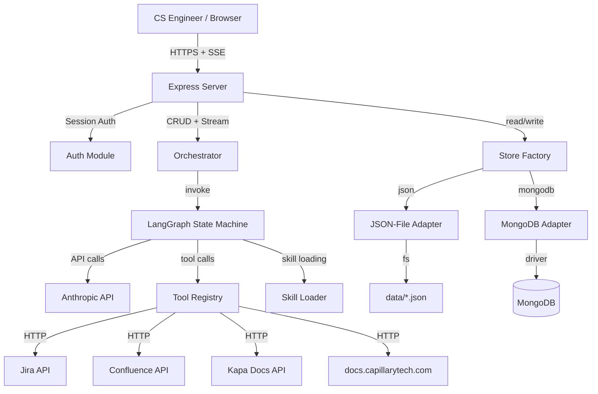
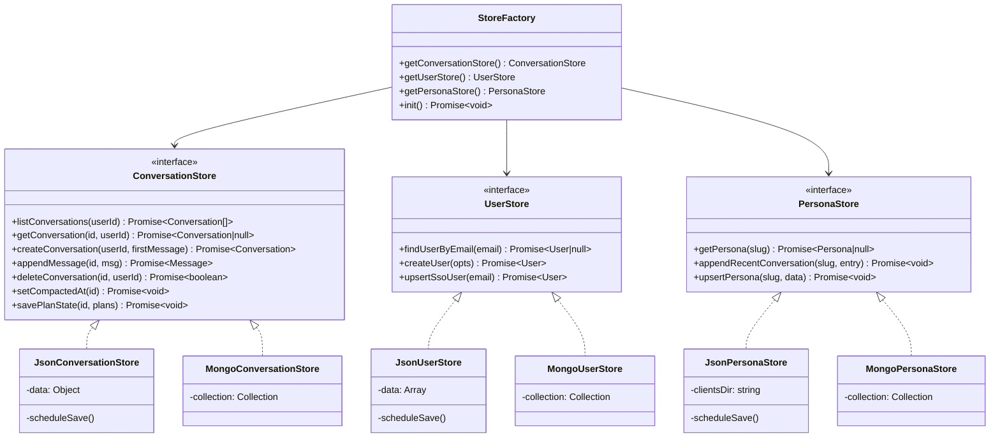
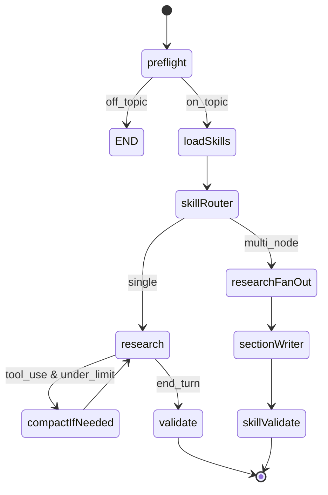

# Design Document — Platform Persistence & Efficiency

## Overview

This design replaces the Capillary Solution Agent's flat-file storage (`data/conversations.json`, `data/users.json`, `data/clients/*.md`) with a **store adapter pattern**, adds in-session context compaction, intent-based dynamic tool and skill loading, an off-topic request gate, full skill catalogue exposure, and agent planning tools.

The store adapter pattern defines common interfaces for all persistence operations (`conversationStore`, `userStore`, `personaStore`) and provides two interchangeable implementations:

1. **JSON-file adapter** (`STORE_BACKEND=json`) — upgrades the existing flat-file code to match the new interface shape (userId scoping, async API, etc.). Ships immediately with zero new infrastructure.
2. **MongoDB adapter** (`STORE_BACKEND=mongodb`) — implements the same interface using the `mongodb` npm driver. Swapped in when MongoDB is provisioned.

A factory module (`src/stores/index.js`) reads `STORE_BACKEND` from the environment and exports the selected adapter. All calling code (`server.js`, `graph.js`, `orchestrator.js`, `auth.js`) imports only from the factory — never directly from a specific backend.

The changes touch every layer of the stack:

- **Persistence layer** — new `src/stores/` directory with interface definitions, a factory, and two adapter implementations (JSON-file and MongoDB).
- **LangGraph state machine** — new nodes for context compaction and a modified `classify` node that combines the gate, intent classification, and skill/tool selection into a single parallel pre-flight step.
- **Tool registry** — `src/tools/index.js` gains a `filterByIntent()` function and three new plan tools.
- **Skill loader** — `src/skillLoader.js` gains a `getSkillCatalogue()` function that returns lightweight metadata for all registered skills.
- **SSE events** — new event types: `plan_update`.

### Design Decisions

| Decision | Choice | Rationale |
|---|---|---|
| Persistence strategy | Store adapter pattern with factory | Decouples business logic from storage backend. JSON-file adapter ships day one with no new dependencies. MongoDB adapter swaps in later without changing any calling code. |
| JSON-file adapter | Upgrade existing `src/store.js` to match new interface | Preserves current flat-file behaviour while adding userId scoping, async API shape, and new fields (compactedAt, plans). Zero new dependencies. |
| MongoDB adapter | Raw `mongodb` npm driver (optional dependency) | Conversations and personas are document-shaped. The existing JSON structures map directly to MongoDB documents. Railway supports MongoDB add-ons natively. |
| Backend selection | `STORE_BACKEND` env var (`json` or `mongodb`) | Simple config switch. Defaults to `json` so the app works out of the box. |
| ODM | None — raw `mongodb` driver | Mongoose adds ~500 KB and schema rigidity we don't need. The raw driver keeps the dependency surface small. |
| Migration strategy | One-time import at startup (only when switching to MongoDB) | The migration module reads old JSON files, inserts into MongoDB, and renames originals to `.migrated`. Only runs when `STORE_BACKEND=mongodb`. |
| Token estimation | Character-count heuristic (chars / 3.5) | Anthropic doesn't expose a tokeniser in JS. The 3.5 ratio is a well-known approximation for Claude's tokeniser. |
| Gate + Intent in one call | Single Haiku call returns `{ onTopic, toolTags, skillIds }` | Saves one Haiku round-trip per request. |
| Plan storage | LangGraph state channel + DB conversation record | Plans are ephemeral within a conversation turn but persisted alongside messages for reload. |
| Skill catalogue | Injected into system prompt as a compact list | ~200 tokens for 4 skills. Cheap enough to always include. |
| `mongodb` dependency | Optional — only needed when `STORE_BACKEND=mongodb` | Keeps the default install lightweight. Add `mongodb` to `package.json` only when ready to use MongoDB. |

---

## Architecture

### System Context



### Store Adapter Pattern



### Modified LangGraph State Machine



Key changes from the current graph:

1. **`classify` → `preflight`**: The old `classify` node is replaced by `preflight`, which runs the gate check, intent classification, and request classification in a single parallel Haiku call. If the gate fires, the graph short-circuits to END with a refusal message.
2. **`compactIfNeeded`**: A new node inserted in the research loop. Before each Anthropic API call, it checks the estimated token count and compacts if above threshold.
3. **Plan tools**: Added to the tool definitions array, always included. The LLM can call `create_plan`, `update_plan_step`, and `get_plan` during any research turn.
4. **Skill catalogue**: Injected into the system prompt by `loadSkills`, always present regardless of intent classification.

### Module Dependency Graph

```mermaid
graph LR
    server[server.js] --> orchestrator[orchestrator.js]
    server --> storeFactory[stores/index.js]
    orchestrator --> graph[graph.js]
    graph --> tools[tools/index.js]
    graph --> skillLoader[skillLoader.js]
    graph --> subAgent[subAgent.js]
    graph --> compaction[compaction.js]
    graph --> planManager[planManager.js]
    storeFactory --> jsonAdapters[stores/json/*]
    storeFactory --> mongoAdapters[stores/mongo/*]
    storeFactory --> db[db.js]
    server --> db
    auth[auth.js] --> storeFactory
```

---

## Components and Interfaces

### 1. `src/stores/index.js` — Store Factory

Central factory that reads `STORE_BACKEND` from the environment and exports the selected adapter implementations. All calling code imports from here.

```typescript
// Pseudo-interface (ES module exports)
export async function init(): Promise<void>          // initialise the selected backend
export function getConversationStore(): ConversationStore
export function getUserStore(): UserStore
export function getPersonaStore(): PersonaStore
```

- Reads `STORE_BACKEND` from env (default: `json`).
- When `json`: imports from `src/stores/json/` adapters, calls their `init()`.
- When `mongodb`: imports from `src/stores/mongo/` adapters, calls `connectDB()` first.
- `init()` is called once at startup in `server.js`, before `app.listen()`.
- If `STORE_BACKEND=mongodb` and connection fails, logs fatal error and exits with code 1 (NFR-2).

### 2. Store Interfaces

All three stores share a common async interface shape. The JSON-file and MongoDB adapters both implement these signatures identically.

#### `ConversationStore` Interface

```typescript
export async function listConversations(userId: string): Conversation[]
export async function getConversation(id: string, userId: string): Conversation | null
export async function createConversation(userId: string, firstMessage: string): Conversation
export async function appendMessage(id: string, msg: Message): Message
export async function deleteConversation(id: string, userId: string): boolean
export async function setCompactedAt(id: string): void
export async function savePlanState(id: string, plans: Plan[]): void
```

- All list/get operations are scoped by `userId` (Req 1.4).
- `appendMessage` is atomic — JSON adapter uses a write queue, MongoDB uses `$push` (Req 1.2).
- `savePlanState` stores the plan array alongside the conversation document (Req 9.6).

#### `UserStore` Interface

```typescript
export async function findUserByEmail(email: string): User | null
export async function createUser(opts: { email, password?, role? }): User
export async function upsertSsoUser(email: string): User
```

- `findUserByEmail` uses case-insensitive lookup (Req 2.2).
- `createUser` hashes password with bcrypt before insert (Req 2.1).
- `upsertSsoUser` handles first-login vs subsequent-login atomically (Req 2.3, 2.4).
- Duplicate email detection: JSON adapter checks in-memory, MongoDB uses unique index (Req 2.7).

#### `PersonaStore` Interface

```typescript
export async function getPersona(slug: string): Persona | null
export async function appendRecentConversation(slug: string, entry: { date, summary }): void
export async function upsertPersona(slug: string, data: Partial<Persona>): void
```

- `getPersona` uses case-insensitive lookup on `slug` (Req 3.2).
- Returns `null` for missing slugs — no placeholder creation (Req 3.3).
- `appendRecentConversation` appends atomically (Req 3.4).

### 3. JSON-File Adapters (`src/stores/json/`)

Upgrades the existing `src/store.js` flat-file approach to match the new interface shape.

#### `src/stores/json/conversationStore.js`

- Reads/writes `data/conversations.json` (same file as current `src/store.js`).
- Adds `userId` field to each conversation and scopes all queries by it.
- Adds `compactedAt` and `plans` fields.
- Uses the same write-queue pattern from `src/store.js` to prevent concurrent write corruption.

#### `src/stores/json/userStore.js`

- Reads/writes `data/users.json` (same file as current `src/auth.js` helpers).
- Implements case-insensitive email lookup via `.toLowerCase()` comparison.
- Hashes passwords with bcrypt before storing.
- Throws on duplicate email (matching current `createUser` behaviour).

#### `src/stores/json/personaStore.js`

- Reads/writes `data/personas.json` (migrated from `data/clients/*.md` individual files to a single JSON file for consistency).
- Implements case-insensitive slug lookup.
- Appends to `recentConversations` array in-memory, flushes to disk.

### 4. MongoDB Adapters (`src/stores/mongo/`)

Implements the same interfaces using the `mongodb` npm driver. Only loaded when `STORE_BACKEND=mongodb`.

#### `src/stores/mongo/conversationStore.js`

- Uses `getDb().collection('conversations')`.
- `appendMessage` uses `$push` for atomic message append.
- `savePlanState` uses `$set` on the `plans` field.

#### `src/stores/mongo/userStore.js`

- Uses `getDb().collection('users')`.
- `findUserByEmail` uses case-insensitive regex query.
- `upsertSsoUser` uses `findOneAndUpdate` with `upsert: true`.
- Unique index on `email` prevents duplicates at DB level; catches `E11000` → 409 Conflict.

#### `src/stores/mongo/personaStore.js`

- Uses `getDb().collection('personas')`.
- `getPersona` uses case-insensitive lookup on `slug`.
- `appendRecentConversation` uses `$push` for atomic append.

### 5. `src/db.js` — MongoDB Connection Manager

Only used when `STORE_BACKEND=mongodb`. Manages the MongoDB client lifecycle.

```typescript
export async function connectDB(): Promise<Db>
export function getDb(): Db                    // throws if not connected
export async function closeDB(): Promise<void>
```

- Reads `MONGODB_URI` from env (required when `STORE_BACKEND=mongodb`).
- Reads `MONGODB_DB_NAME` from env (default: `capillary_agent`).
- `connectDB()` is called by the store factory's `init()` when backend is `mongodb`.
- If connection fails, logs fatal error and exits with code 1 (NFR-2).
- Creates indexes on first connect (conversations: `userId`; users: `email` unique; personas: `slug` unique).

### 6. `src/migration.js` — One-Time Data Migration

Only needed when switching from JSON files to MongoDB.

```typescript
export async function runMigrations(): Promise<void>
```

- Checks for `data/conversations.json`, `data/users.json`, `data/clients/` directory.
- For each that exists (and no `.migrated` counterpart exists): reads, inserts into MongoDB, renames to `.migrated`.
- Idempotent: skips if `.migrated` already exists (NFR-1).
- Called at startup after `connectDB()` only when `STORE_BACKEND=mongodb`.

### 7. `src/compaction.js` — Context Compaction Service

```typescript
export function estimateTokens(messages: Message[]): number
export async function compactIfNeeded(messages: Message[], threshold?: number): { messages: Message[], compacted: boolean }
```

- `estimateTokens`: sums `content.length / 3.5` across all messages.
- `compactIfNeeded`: if estimate > threshold, takes all messages except the last 4, sends them to Haiku with a summarisation prompt, replaces them with a single `{ role: 'user', content: '[Context Summary] ...' }` message.
- Threshold from `CONTEXT_COMPACTION_THRESHOLD` env var, default 60000 (Req 4.6).
- On Haiku failure: logs error, returns original messages unchanged (Req 4.7).
- Works identically regardless of which store backend is active.

### 8. `src/planManager.js` — Agent Planning Tools

```typescript
export function createPlan(title: string, steps: string[]): Plan
export function updatePlanStep(planId: string, stepIndex: number, status: StepStatus): Plan
export function getPlan(planId: string): Plan | null
export function getAllPlans(): Plan[]
export function clearPlans(): void
```

- Plans are stored in a module-level `Map<string, Plan>`.
- `createPlan` validates non-empty title and steps array (Req 9.8), generates a UUID `planId`, initialises all steps to `pending`.
- `updatePlanStep` validates `stepIndex` bounds and `status` enum.
- The graph node calls `onPlanUpdate` SSE callback after each mutation (Req 9.4).
- Plans are serialised into LangGraph state and persisted via `savePlanState` on the conversation store (Req 9.5, 9.6).
- Works identically regardless of which store backend is active.

Plan tool definitions (added to `src/tools/index.js`):

```javascript
const PLAN_DEFINITIONS = [
  {
    name: 'create_plan',
    description: 'Create a structured plan with steps to track progress on a complex request.',
    input_schema: {
      type: 'object',
      properties: {
        title: { type: 'string', description: 'Plan title describing the overall goal' },
        steps: { type: 'array', items: { type: 'string' }, description: 'Ordered list of step descriptions' },
      },
      required: ['title', 'steps'],
    },
  },
  {
    name: 'update_plan_step',
    description: 'Update the status of a plan step.',
    input_schema: {
      type: 'object',
      properties: {
        planId: { type: 'string', description: 'Plan ID returned by create_plan' },
        stepIndex: { type: 'integer', description: 'Zero-based index of the step to update' },
        status: { type: 'string', enum: ['pending', 'in_progress', 'completed', 'skipped'], description: 'New status' },
      },
      required: ['planId', 'stepIndex', 'status'],
    },
  },
  {
    name: 'get_plan',
    description: 'Retrieve the current state of a plan.',
    input_schema: {
      type: 'object',
      properties: {
        planId: { type: 'string', description: 'Plan ID to retrieve' },
      },
      required: ['planId'],
    },
  },
];
```

### 9. `src/preflight.js` — Combined Gate + Intent Classifier

Replaces the separate `classifyRequest` in orchestrator and the semantic skill matching in the classify node.

```typescript
export async function runPreflight(problemText: string): Promise<PreflightResult>

interface PreflightResult {
  onTopic: boolean
  refusalMessage?: string
  classification: { type: string, confidence: number, missingInfo: string[] }
  toolTags: string[]       // e.g. ['jira', 'confluence']
  skillIds: string[]       // e.g. ['capillary-sdd-writer']
  skillReasons: Record<string, string>  // skillId → reason
}
```

- Single Haiku call with a combined prompt that asks for gate decision, request classification, tool tags, and skill IDs.
- 3-second timeout; on timeout or failure, returns `{ onTopic: true, toolTags: [], skillIds: [] }` (fail-open).
- Gate confidence threshold: ≥ 0.85 to classify as off-topic (Req 7.6).
- Works identically regardless of which store backend is active.

### 10. Skill Catalogue in `src/skillLoader.js`

New export:

```typescript
export function getSkillCatalogue(): string
```

- Returns a compact markdown block listing all skills from `registry.json`:
  ```
  ## Available Skills
  - **capillary-sdd-writer**: Generate a developer-ready Capillary SDD... (triggers: sdd, system design document, ...)
  - **solution-gap-analyzer**: Analyze a BRD to predict Capillary match... (triggers: gap, brd, ...)
  ...
  Use `activate_skill` with the skill ID to load full instructions.
  ```
- Injected into the system prompt by `loadSkills` node, always present (Req 8.1, 8.2).
- ~50 tokens per skill. At 4 skills, ~200 tokens total — negligible overhead (Req 8.3).

### 11. Modified `src/tools/index.js`

New function:

```typescript
export function getToolsByIntent(toolTags: string[]): { definitions: object[], handle: Function }
```

- If `toolTags` is empty or null, returns all tools (fallback behaviour, Req 5.4).
- Otherwise, filters `definitions` to only include tools whose category matches a tag.
- Always includes `list_skills`, `activate_skill`, and plan tools regardless of tags (Req 5.3, 9.7).
- Tool-to-category mapping:
  - `jira`: `get_jira_ticket`, `search_jira`
  - `confluence`: `search_confluence`, `get_confluence_page`
  - `kapa_docs`: `search_kapa_docs`
  - `web_search`: `search_docs_site`
  - `skills`: `list_skills`, `activate_skill` (always included anyway)

---

## Data Models

### Store Data Shapes

These shapes are used by both the JSON-file and MongoDB adapters. The JSON-file adapter stores them as-is in JSON files. The MongoDB adapter stores them as documents in collections.

#### Conversation

```javascript
{
  id: String,              // UUID
  userId: String,          // for scoping
  title: String,
  createdAt: ISODate,
  updatedAt: ISODate,
  compactedAt: ISODate,    // set when compaction occurs (NFR-4)
  messages: [
    {
      role: 'user' | 'assistant',
      content: String,
      skillsUsed: [String],  // optional
      escalated: Boolean,    // optional
      files: [String],       // optional, original filenames
      timestamp: ISODate
    }
  ],
  plans: [                  // persisted plan state (Req 9.6)
    {
      planId: String,
      title: String,
      steps: [
        { description: String, status: 'pending' | 'in_progress' | 'completed' | 'skipped' }
      ],
      createdAt: ISODate,
      updatedAt: ISODate
    }
  ]
}
```

#### User

```javascript
{
  id: String,              // UUID
  email: String,           // unique (case-insensitive)
  passwordHash: String,    // null for SSO users
  role: 'user' | 'admin',
  createdAt: ISODate
}
```

#### Persona

```javascript
{
  slug: String,            // unique (case-insensitive)
  displayName: String,
  overview: String,
  modules: String,
  knownIssues: String,
  recentConversations: [
    { date: ISODate, summary: String }
  ],
  updatedAt: ISODate
}
```

### MongoDB Indexes (only when `STORE_BACKEND=mongodb`)

#### `conversations` collection
- `{ userId: 1, updatedAt: -1 }` — for listing conversations sorted by recency
- `{ id: 1 }` unique — for direct lookup

#### `users` collection
- `{ email: 1 }` unique with collation `{ locale: 'en', strength: 2 }` — case-insensitive uniqueness
- `{ id: 1 }` unique

#### `personas` collection
- `{ slug: 1 }` unique with collation `{ locale: 'en', strength: 2 }`

### LangGraph State Channels (additions)

```javascript
// New channels added to the existing graph state
{
  // ... existing channels ...
  compacted: { value: (_, n) => n ?? false, default: () => false },
  plans: { value: (_, n) => n ?? [], default: () => [] },
  toolTags: { value: (_, n) => n ?? [], default: () => [] },
  onTopic: { value: (_, n) => n ?? true, default: () => true },
  refusalMessage: { value: (_, n) => n ?? '', default: () => '' },
  skillCatalogue: { value: (_, n) => n ?? '', default: () => '' },
}
```

### Plan Object Shape

```javascript
{
  planId: String,          // UUID
  title: String,
  steps: [
    {
      description: String,
      status: 'pending' | 'in_progress' | 'completed' | 'skipped'
    }
  ],
  createdAt: ISODate,
  updatedAt: ISODate
}
```

### SSE Event Types (additions)

| Event | Payload | When |
|---|---|---|
| `plan_update` | `{ planId, title, steps: [{ description, status }] }` | After `create_plan` or `update_plan_step` tool execution |

### Environment Variables (additions)

| Variable | Required | Default | Description |
|---|---|---|---|
| `STORE_BACKEND` | No | `json` | Storage backend: `json` (flat files) or `mongodb` |
| `MONGODB_URI` | Only when `STORE_BACKEND=mongodb` | — | MongoDB connection string |
| `MONGODB_DB_NAME` | No | `capillary_agent` | Database name (MongoDB only) |
| `CONTEXT_COMPACTION_THRESHOLD` | No | `60000` | Token count threshold for compaction |


---

## Correctness Properties

*A property is a characteristic or behavior that should hold true across all valid executions of a system — essentially, a formal statement about what the system should do. Properties serve as the bridge between human-readable specifications and machine-verifiable correctness guarantees.*

### Property 1: Conversation round-trip

*For any* valid conversation data (userId, title, messages), creating a conversation and then retrieving it by ID (scoped to the same userId) SHALL return a document containing all original fields (`id`, `userId`, `title`, `createdAt`, `updatedAt`) and all appended messages in order.

**Validates: Requirements 1.1, 1.2**

### Property 2: Conversation user scoping

*For any* two distinct userIds and any set of conversations created by each user, listing or retrieving conversations for userId A SHALL never return conversations belonging to userId B, and vice versa.

**Validates: Requirements 1.4**

### Property 3: Migration idempotency

*For any* valid source data (conversations JSON, users JSON, or client persona markdown files), running the migration routine twice SHALL produce the same set of records in the database as running it once — no duplicates, no data corruption.

**Validates: Requirements 1.7, 2.6, 3.6**

### Property 4: User store round-trip with case-insensitive lookup

*For any* valid user data (email, password, role), creating a user and then looking up by email with any casing variation SHALL return the same user record with all original fields (`id`, `email`, `passwordHash`, `role`, `createdAt`).

**Validates: Requirements 2.1, 2.2**

### Property 5: SSO upsert idempotence

*For any* email string, calling `upsertSsoUser` N times (N ≥ 1) SHALL always return the same user record and SHALL result in exactly one user document in the database for that email.

**Validates: Requirements 2.4**

### Property 6: Persona store round-trip with case-insensitive lookup

*For any* valid persona data (slug, displayName, overview, modules, knownIssues), upserting a persona and then retrieving it by slug with any casing variation SHALL return the same persona document with all original fields.

**Validates: Requirements 3.1, 3.2**

### Property 7: Persona append preserves existing entries

*For any* persona with N existing `recentConversations` entries, appending a new entry SHALL result in N+1 entries where the first N entries are unchanged and the (N+1)th entry matches the appended data.

**Validates: Requirements 3.4**

### Property 8: Compaction preserves recent messages and reduces total

*For any* message array whose estimated token count exceeds the compaction threshold, running `compactIfNeeded` SHALL return a message array where: (a) the last 4 messages are identical to the original last 4, (b) the total message count is strictly less than the original, and (c) the first message is a summary message with role `user`.

**Validates: Requirements 4.2**

### Property 9: Tool filtering respects tags and always includes meta-tools

*For any* non-empty set of tool category tags, `getToolsByIntent(tags)` SHALL return tool definitions where: (a) every non-meta tool belongs to a tagged category, (b) `list_skills` and `activate_skill` are always present, and (c) `create_plan`, `update_plan_step`, and `get_plan` are always present.

**Validates: Requirements 5.2, 5.3, 9.7**

### Property 10: Skill loading respects intent classification

*For any* intent classification result (skillIds, classification type), the set of loaded skills SHALL equal the union of: (a) intent-identified skills, (b) `alwaysLoad: true` skills that pass the cr-evaluator re-evaluation rule (omitted when type is `general_query` with no CR indicators), and no other skills.

**Validates: Requirements 6.2, 6.3, 6.4**

### Property 11: Gate confidence threshold

*For any* gate classification result with an `offTopicConfidence` value, the message SHALL be blocked if and only if `offTopicConfidence >= 0.85`. All results with confidence below 0.85 SHALL proceed to the main agent loop.

**Validates: Requirements 7.6**

### Property 12: Skill catalogue completeness and compactness

*For any* skill registry containing N skills, `getSkillCatalogue()` SHALL return a string that: (a) contains the ID and description of every registered skill (N entries), and (b) does NOT contain the full content of any SKILL.md file.

**Validates: Requirements 8.1, 8.3**

### Property 13: Plan update isolation

*For any* plan with N steps and any valid step index I and status S, calling `updatePlanStep(planId, I, S)` SHALL change only step I to status S while leaving all other steps unchanged.

**Validates: Requirements 9.2**

### Property 14: Plan create-get round-trip

*For any* valid title and non-empty steps array, creating a plan and then calling `getPlan` with the returned `planId` SHALL return a plan where the title matches, all steps match the input descriptions, and all step statuses are `pending`.

**Validates: Requirements 9.1, 9.3**

### Property 15: Plan input validation

*For any* input where `title` is empty/whitespace or `steps` is an empty array, `createPlan` SHALL return an error and SHALL NOT create a plan object.

**Validates: Requirements 9.8**

---

## Error Handling

### Store Adapter Errors

| Scenario | Behaviour | Requirement |
|---|---|---|
| `STORE_BACKEND=mongodb` and MongoDB connection fails at startup | Log fatal error, `process.exit(1)` | NFR-2 |
| `STORE_BACKEND=json` (default) | No external dependencies, always succeeds | — |
| Invalid `STORE_BACKEND` value | Log fatal error, `process.exit(1)` | Defensive |
| DB write fails during `appendMessage` | Return HTTP 500 with conversation ID and error details in log | 1.5 |
| DB write fails during `createConversation` | Return HTTP 500, log error | 1.5 |
| Duplicate email on `createUser` | JSON adapter throws in-memory check; MongoDB catches `E11000` → 409 Conflict | 2.5, 2.7 |
| Duplicate slug on persona upsert | Use upsert semantics — no conflict possible | 3.7 |

### Compaction Errors

| Scenario | Behaviour | Requirement |
|---|---|---|
| Haiku summarisation call fails | Log error with conversation ID, proceed with full uncompacted messages | 4.7 |
| Token estimation returns NaN | Default to 0 (no compaction triggered) | Defensive |

### Intent Classifier / Gate Errors

| Scenario | Behaviour | Requirement |
|---|---|---|
| Haiku preflight call fails | Fail open: `onTopic: true`, all tools, keyword-based skill matching | 5.4, 6.5, 7.5 |
| Preflight exceeds 3s timeout | Abort Haiku call, use fallback defaults | 5.5, 7.5 |
| Gate returns malformed JSON | Treat as on-topic, log warning | Defensive |
| Intent classifier returns unknown tool tag | Ignore unknown tags, include only recognised categories | Defensive |

### Plan Tool Errors

| Scenario | Behaviour | Requirement |
|---|---|---|
| `create_plan` with empty title or steps | Return error string: `"Validation error: title and steps are required and must be non-empty"` | 9.8 |
| `update_plan_step` with invalid planId | Return error string: `"Plan not found: {planId}"` | Defensive |
| `update_plan_step` with out-of-bounds stepIndex | Return error string: `"Step index {i} out of bounds (plan has {n} steps)"` | Defensive |
| `update_plan_step` with invalid status | Return error string: `"Invalid status: {s}. Must be one of: pending, in_progress, completed, skipped"` | Defensive |

### Migration Errors

| Scenario | Behaviour | Requirement |
|---|---|---|
| Source JSON file is corrupt/unparseable | Log error with filename, skip that migration, do NOT rename to `.migrated` | NFR-1 |
| Partial insert failure (some docs inserted, some fail) | Log which records failed, do NOT rename to `.migrated` so migration retries on next startup | NFR-1 |
| `.migrated` file already exists | Skip migration entirely (idempotent) | NFR-1 |

---

## Testing Strategy

### Property-Based Tests (fast-check)

The project already uses `fast-check` (v4.7.0) and `vitest` (v4.1.4). All property tests will use fast-check with a minimum of 100 iterations per property.

Each property test file will be tagged with a comment referencing the design property:

```javascript
// Feature: platform-persistence-and-efficiency, Property 1: Conversation round-trip
```

**Property test files:**

| File | Properties Covered | What's Tested |
|---|---|---|
| `src/__tests__/conversationStore.prop.test.js` | P1, P2 | Round-trip, user scoping (tested against the store interface — works with either adapter) |
| `src/__tests__/userStore.prop.test.js` | P4, P5 | Round-trip with case-insensitive lookup, SSO idempotence |
| `src/__tests__/personaStore.prop.test.js` | P6, P7 | Round-trip, append preservation |
| `src/__tests__/migration.prop.test.js` | P3 | Migration idempotency (MongoDB adapter only) |
| `src/__tests__/compaction.prop.test.js` | P8 | Compaction preserves recent messages, reduces total |
| `src/__tests__/toolFilter.prop.test.js` | P9 | Tag-based filtering, always-on meta-tools |
| `src/__tests__/skillLoading.prop.test.js` | P10, P12 | Intent-based skill loading, catalogue completeness |
| `src/__tests__/gate.prop.test.js` | P11 | Confidence threshold enforcement |
| `src/__tests__/planManager.prop.test.js` | P13, P14, P15 | Update isolation, round-trip, input validation |

**Testing approach for store properties (P1–P7):** Property tests run against the store interface. For Phase 1 (JSON-file adapter), tests use the JSON adapter directly. For Phase 2 (MongoDB adapter), the same tests can be re-run against the MongoDB adapter using `mongodb-memory-server` or `Map`-based stubs. The property tests validate the store contract, not a specific backend.

**Testing approach for compaction (P8):** Mock the Haiku call to return a deterministic summary string. The property tests validate the compaction logic (message selection, preservation of last 4, count reduction).

### Unit Tests (vitest)

Unit tests cover specific examples, edge cases, and error conditions that don't warrant property-based testing:

| File | What's Tested |
|---|---|
| `src/__tests__/conversationStore.test.js` | DB write failure → HTTP 500, empty message handling |
| `src/__tests__/userStore.test.js` | SSO first login creates user, duplicate email conflict, bootstrap admin |
| `src/__tests__/personaStore.test.js` | Missing slug returns null, get_client_persona tool registration |
| `src/__tests__/compaction.test.js` | Haiku failure fallback, SSE event emission, env var configuration |
| `src/__tests__/preflight.test.js` | Off-topic refusal message content, timeout fallback, parallel execution |
| `src/__tests__/planManager.test.js` | SSE event emission on create/update, invalid planId/stepIndex errors |
| `src/__tests__/migration.test.js` | Corrupt JSON handling, partial insert recovery, already-migrated skip |
| `src/__tests__/skillLoader.test.js` | (existing) + catalogue generation from registry, dynamic refresh |
| `src/__tests__/toolFilter.test.js` | Empty tag fallback to all tools, unknown tag ignored |
| `src/__tests__/storeFactory.test.js` | Factory returns correct adapter based on `STORE_BACKEND` env var |

### Integration Tests

Integration tests verify end-to-end flows that span multiple components:

| Test | What's Verified |
|---|---|
| Store adapter swap | Same test suite passes against both JSON-file and MongoDB adapters |
| Full conversation lifecycle | Create → append → list (scoped) → delete (via store interface) |
| Startup migration flow (MongoDB) | JSON files → MongoDB → `.migrated` rename |
| Compaction in graph context | Long conversation triggers compaction, store retains full history |
| Gate → refusal flow | Off-topic message → no graph invocation → refusal SSE events |
| Plan lifecycle in conversation | Create plan → update steps → persist → reload |

### Test Configuration

- **Runner:** `vitest --run` (single execution, no watch mode)
- **PBT library:** `fast-check` v4.7.0 (already in devDependencies)
- **Minimum iterations:** 100 per property test (`fc.assert(property, { numRuns: 100 })`)
- **Store mocking:** JSON adapter tests use real file I/O to a temp directory. MongoDB adapter tests use `mongodb-memory-server` or `Map`-based stubs.
- **Haiku mocking:** Direct mock of `runSubAgent` to return deterministic responses
