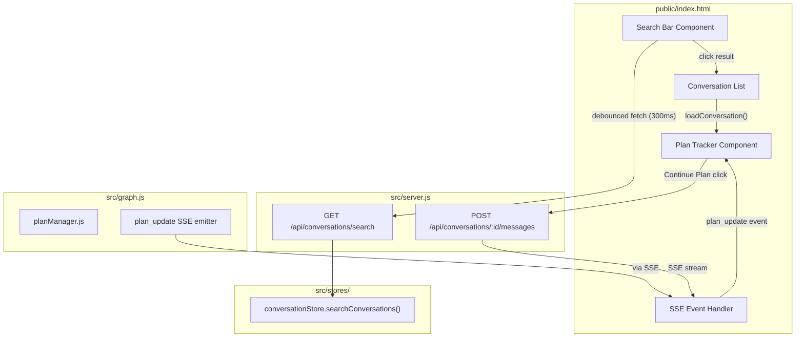
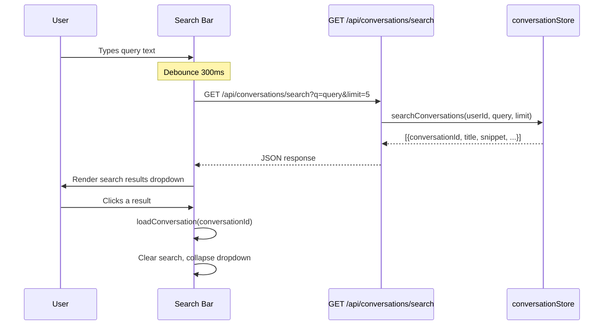
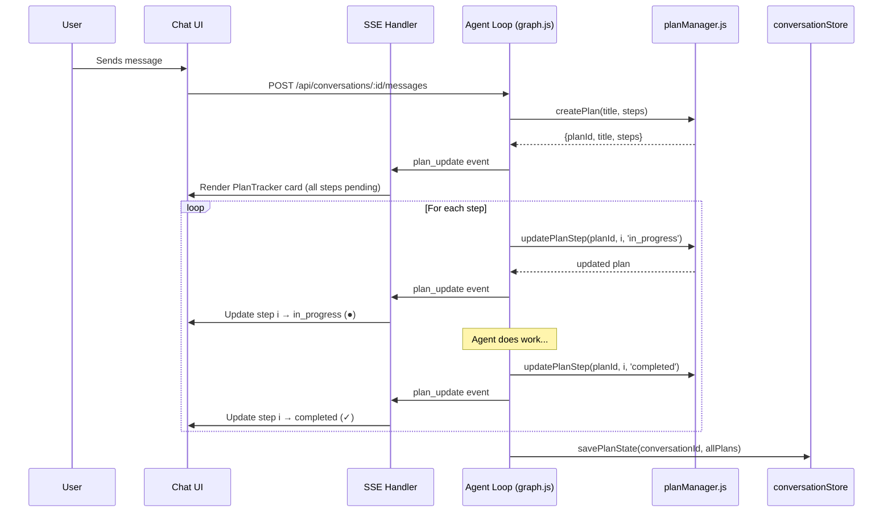
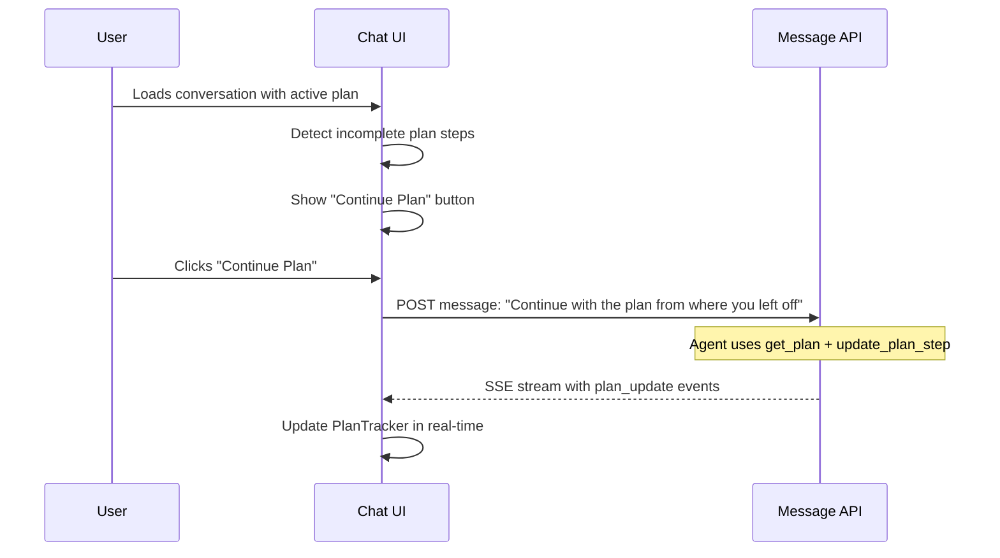

# Design Document: Search and Planning UI

## Overview

This feature adds two user-facing UI components to the existing Solution Agent frontend: a **Conversation History Search** bar in the sidebar and an **Agent Planning Tools** visual tracker in the chat area. Both features connect to existing backend infrastructure — the `searchConversations()` store method and the `planManager.js` plan tools with `plan_update` SSE events — that currently have no frontend representation.

The search UI provides a debounced text input above the conversation list that queries a new HTTP endpoint (`GET /api/conversations/search`), displaying matching conversations with message snippets. The plan UI renders structured plan cards in the chat stream, updating in real-time via SSE events, and supports plan continuation for long-running multi-turn tasks. Both components follow the existing design system (CSS variables, Inter font, light/dark themes) and are responsive.

## Architecture



## Sequence Diagrams

### Conversation Search Flow



### Plan Creation and Real-Time Update Flow



### Plan Continuation Flow



## Components and Interfaces

### Component 1: Search Bar

**Purpose**: Provides a text input in the sidebar for searching across conversation history with debounced API calls and a results dropdown.

**Interface**:
```javascript
// DOM structure injected into sidebar
// <div class="search-container">
//   <div class="search-input-wrapper">
//     <span class="search-icon">🔍</span>
//     <input class="search-input" placeholder="Search conversations..." />
//     <button class="search-clear" style="display:none">✕</button>
//   </div>
//   <div class="search-results" style="display:none"></div>
// </div>

// State
let searchDebounceTimer = null;

// Functions
function handleSearchInput(query) { /* debounce → fetchSearchResults */ }
async function fetchSearchResults(query) { /* GET /api/conversations/search */ }
function renderSearchResults(results) { /* populate .search-results dropdown */ }
function clearSearch() { /* reset input, hide dropdown */ }
```

**Responsibilities**:
- Debounce user input (300ms) before making API calls
- Render search results with conversation title, timestamp, and snippet
- Highlight matching text in snippets
- Navigate to selected conversation via existing `loadConversation()`
- Clear search state when a result is selected or input is cleared
- Show empty state when no results match

### Component 2: Plan Tracker

**Purpose**: Renders agent plans as visual progress cards in the chat stream, updating in real-time via SSE events.

**Interface**:
```javascript
// DOM structure for a plan card
// <div class="plan-card" data-plan-id="uuid">
//   <div class="plan-header" onclick="togglePlanCollapse(planId)">
//     <span class="plan-collapse-icon">▼</span>
//     <span class="plan-title">Plan Title</span>
//     <span class="plan-progress">3/5</span>
//   </div>
//   <div class="plan-steps">
//     <div class="plan-step pending">
//       <span class="step-status">○</span>
//       <span class="step-description">Step description</span>
//     </div>
//     ...
//   </div>
//   <button class="plan-continue-btn" style="display:none">▶ Continue Plan</button>
// </div>

// Plan state cache (for rendering on conversation load)
const planCache = new Map(); // planId → plan object

// Functions
function renderPlanCard(plan) { /* create or update plan card DOM */ }
function updatePlanFromSSE(planData) { /* handle plan_update event */ }
function togglePlanCollapse(planId) { /* expand/collapse steps */ }
function renderSavedPlans(plans) { /* render plans from loaded conversation */ }
function isPlanActive(plan) { /* check if any steps are not completed/skipped */ }
function handleContinuePlan(planId) { /* send continuation message */ }
```

**Responsibilities**:
- Create plan cards when `plan_update` SSE events arrive for new plans
- Update step statuses in real-time as SSE events stream in
- Show status indicators: pending (○), in_progress (●), completed (✓), skipped (⊘)
- Auto-collapse completed plans, keep active plans expanded
- Show progress counter (e.g., "3/5") in the header
- Render saved plans when loading a conversation with persisted plan data
- Show "Continue Plan" button for plans with incomplete steps

### Component 3: Search API Endpoint

**Purpose**: HTTP route that exposes the existing `searchConversations()` store method to the frontend.

**Interface**:
```javascript
// GET /api/conversations/search?q=<query>&limit=5
// Response: { results: [{ conversationId, title, createdAt, updatedAt, snippet }] }

app.get('/api/conversations/search', async (req, res) => {
  const query = req.query.q?.trim();
  const limit = Math.min(Math.max(parseInt(req.query.limit) || 5, 1), 20);
  if (!query) return res.json({ results: [] });

  const convStore = getConversationStore();
  const results = await convStore.searchConversations(req.session.userId, query, limit);
  res.json({ results });
});
```

**Responsibilities**:
- Validate and sanitize query parameter
- Clamp limit to 1–20 range
- Scope search to authenticated user via `req.session.userId`
- Return empty results for empty queries

## Data Models

### Search Result

```javascript
/**
 * @typedef {Object} SearchResult
 * @property {string} conversationId - UUID of the matching conversation
 * @property {string} title - Conversation title (first message summary)
 * @property {string} createdAt - ISO 8601 timestamp
 * @property {string} updatedAt - ISO 8601 timestamp
 * @property {string} snippet - First 200 chars of the first matching message
 */
```

**Validation Rules**:
- `conversationId` is always a valid UUID
- `snippet` is truncated to 200 characters max (enforced by store layer)
- Results are sorted by `updatedAt` descending (enforced by store layer)

### Plan (SSE Payload)

```javascript
/**
 * @typedef {Object} PlanStep
 * @property {string} description - Step description text
 * @property {'pending'|'in_progress'|'completed'|'skipped'} status
 */

/**
 * @typedef {Object} Plan
 * @property {string} planId - UUID
 * @property {string} title - Plan title
 * @property {PlanStep[]} steps - Ordered list of steps with statuses
 * @property {string} createdAt - ISO 8601 timestamp
 * @property {string} updatedAt - ISO 8601 timestamp
 */
```

**Validation Rules**:
- `planId` is a UUID generated by `crypto.randomUUID()`
- `steps` is always a non-empty array
- `status` is always one of the four valid enum values
- Plan data arrives via SSE `plan_update` events and is also stored in conversation documents

### Conversation Document (with Plans)

```javascript
/**
 * Existing conversation document shape, extended with plans field.
 * Plans are already persisted by savePlanState() — no schema change needed.
 *
 * @property {Plan[]} plans - Array of plans associated with this conversation
 */
```

## Key Functions with Formal Specifications

### Function 1: handleSearchInput(query)

```javascript
function handleSearchInput(query) {
  clearTimeout(searchDebounceTimer);
  if (!query.trim()) {
    clearSearch();
    return;
  }
  searchDebounceTimer = setTimeout(() => fetchSearchResults(query.trim()), 300);
}
```

**Preconditions:**
- `query` is a string (may be empty)
- DOM elements `.search-results` and `.search-clear` exist

**Postconditions:**
- If query is empty/whitespace: search results hidden, clear button hidden
- If query is non-empty: a fetch is scheduled 300ms in the future
- Any previously scheduled fetch is cancelled
- No API call is made if another keystroke arrives within 300ms

**Loop Invariants:** N/A

### Function 2: renderPlanCard(plan)

```javascript
function renderPlanCard(plan) {
  let card = document.querySelector(`.plan-card[data-plan-id="${plan.planId}"]`);
  if (!card) { /* create new card DOM */ }
  /* update steps, progress counter, collapse state */
}
```

**Preconditions:**
- `plan` is a valid Plan object with `planId`, `title`, and non-empty `steps` array
- Each step has a valid `status` value

**Postconditions:**
- A `.plan-card` element exists in the DOM with `data-plan-id` matching `plan.planId`
- All steps reflect their current status with correct icons
- Progress counter shows `completedCount/totalCount`
- If all steps are completed/skipped: card is collapsed, "Continue Plan" button hidden
- If any step is pending/in_progress: card is expanded, "Continue Plan" button visible

**Loop Invariants:**
- For each step rendered: the DOM element's class and icon match the step's status

### Function 3: updatePlanFromSSE(planData)

```javascript
function updatePlanFromSSE(planData) {
  planCache.set(planData.planId, planData);
  renderPlanCard(planData);
}
```

**Preconditions:**
- `planData` is a valid Plan object received from a `plan_update` SSE event
- The SSE handler has already parsed the JSON payload

**Postconditions:**
- `planCache` contains the latest state for this plan
- The plan card in the DOM reflects the updated state
- If this is a new plan, a new card is created in the current streaming message container

### Function 4: renderSavedPlans(plans)

```javascript
function renderSavedPlans(plans) {
  if (!plans?.length) return;
  for (const plan of plans) {
    planCache.set(plan.planId, plan);
    renderPlanCard(plan);
  }
}
```

**Preconditions:**
- `plans` is an array of Plan objects (may be null/undefined/empty)
- Called after `renderMessages()` when loading a conversation

**Postconditions:**
- All plans are stored in `planCache`
- Plan cards are rendered in the messages area
- Active plans show "Continue Plan" button
- Completed plans are rendered collapsed

## Algorithmic Pseudocode

### Search Debounce Algorithm

```javascript
// ALGORITHM: Debounced search with result rendering
// INPUT: keystrokes from search input
// OUTPUT: search results dropdown

let searchDebounceTimer = null;

function handleSearchInput(query) {
  // Cancel any pending search
  clearTimeout(searchDebounceTimer);

  // Empty query → clear results immediately
  if (!query.trim()) {
    clearSearch();
    return;
  }

  // Schedule search after 300ms of inactivity
  searchDebounceTimer = setTimeout(async () => {
    const results = await fetchSearchResults(query.trim());
    renderSearchResults(results);
  }, 300);
}

// POSTCONDITION: At most one API call per 300ms of typing inactivity
// POSTCONDITION: Empty queries never trigger API calls
```

### Plan Card State Machine

```javascript
// ALGORITHM: Plan card rendering based on plan state
// INPUT: plan object with steps array
// OUTPUT: DOM update with correct visual state

// Step status → visual mapping
const STEP_ICONS = {
  pending:     '○',
  in_progress: '●',
  completed:   '✓',
  skipped:     '⊘',
};

const STEP_CLASSES = {
  pending:     'step-pending',
  in_progress: 'step-active',
  completed:   'step-completed',
  skipped:     'step-skipped',
};

function renderPlanCard(plan) {
  let card = document.querySelector(`.plan-card[data-plan-id="${plan.planId}"]`);
  const isNew = !card;

  if (isNew) {
    card = document.createElement('div');
    card.className = 'plan-card';
    card.dataset.planId = plan.planId;
    // Insert into current streaming message container or messages area
  }

  const completed = plan.steps.filter(s =>
    s.status === 'completed' || s.status === 'skipped'
  ).length;
  const total = plan.steps.length;
  const isActive = completed < total;

  // Render header with progress
  // Render each step with icon and class
  // LOOP INVARIANT: each step DOM element matches its plan.steps[i].status

  for (let i = 0; i < plan.steps.length; i++) {
    const step = plan.steps[i];
    // Assert: STEP_ICONS[step.status] is defined
    // Assert: STEP_CLASSES[step.status] is defined
    // Render step with correct icon and class
  }

  // Collapse if complete, expand if active
  card.classList.toggle('collapsed', !isActive);

  // Show/hide Continue Plan button
  const continueBtn = card.querySelector('.plan-continue-btn');
  if (continueBtn) continueBtn.style.display = isActive ? '' : 'none';
}
```

### SSE Plan Event Integration

```javascript
// ALGORITHM: Integrate plan_update events into existing SSE handler
// INPUT: SSE event with type 'plan_update' and plan JSON payload
// OUTPUT: Updated plan card in chat UI

// Inside the existing SSE for-loop:
} else if (eventType === 'plan_update') {
  ensureMsgContainer();
  planCache.set(data.planId, data);

  // Find or create plan card
  let card = streamingMsgDiv.querySelector(`.plan-card[data-plan-id="${data.planId}"]`);
  if (!card) {
    card = createPlanCardElement(data);
    if (activityBar) streamingMsgDiv.insertBefore(card, activityBar);
    else streamingMsgDiv.appendChild(card);
  } else {
    updatePlanCardElement(card, data);
  }
  scrollToBottom();
}
```

## Example Usage

### Search Bar Interaction

```javascript
// User types "authentication" in search bar
handleSearchInput('authentication');
// → After 300ms, fetches GET /api/conversations/search?q=authentication&limit=5
// → Response: { results: [
//     { conversationId: 'abc-123', title: 'SSO Setup Discussion',
//       snippet: 'We need to configure authentication for the...', updatedAt: '2025-01-15T...' },
//     { conversationId: 'def-456', title: 'API Security Review',
//       snippet: 'The authentication middleware should validate...', updatedAt: '2025-01-10T...' }
//   ]}
// → Dropdown shows 2 results with highlighted "authentication" in snippets

// User clicks first result
// → loadConversation('abc-123') is called
// → Search dropdown closes, conversation loads
```

### Plan Tracker Rendering

```javascript
// SSE event arrives: plan_update
// data = {
//   planId: 'plan-789',
//   title: 'Research Capillary Loyalty API',
//   steps: [
//     { description: 'Search Confluence for Loyalty API docs', status: 'completed' },
//     { description: 'Check Jira for related tickets', status: 'in_progress' },
//     { description: 'Analyze API endpoints', status: 'pending' },
//     { description: 'Write feasibility summary', status: 'pending' }
//   ]
// }
// → Plan card renders:
//   ┌─────────────────────────────────────────┐
//   │ ▼ Research Capillary Loyalty API    1/4  │
//   │ ✓ Search Confluence for Loyalty API docs │
//   │ ● Check Jira for related tickets         │
//   │ ○ Analyze API endpoints                  │
//   │ ○ Write feasibility summary              │
//   │                                          │
//   │ [▶ Continue Plan]                        │
//   └─────────────────────────────────────────┘
```

### Plan Continuation

```javascript
// User loads a conversation with an active plan (2 of 4 steps completed)
// → renderSavedPlans() renders the plan card with "Continue Plan" button
// User clicks "Continue Plan"
// → sendMessage() is called with text: "Continue with the plan from where you left off"
// → Agent receives message, calls get_plan to check state, resumes from step 3
```

## Correctness Properties

1. **Search debounce**: For any sequence of N keystrokes within 300ms, exactly one API call is made (after the last keystroke + 300ms delay).
2. **Search scoping**: All search results belong to the authenticated user — the endpoint always passes `req.session.userId` to the store method.
3. **Plan card idempotency**: Calling `renderPlanCard(plan)` with the same plan data multiple times produces the same DOM state as calling it once.
4. **Plan step status consistency**: For every step in a rendered plan card, the displayed icon and CSS class match the step's `status` field exactly.
5. **Plan persistence round-trip**: A plan saved via `savePlanState()` and loaded via `getConversation()` renders identically to the same plan received via SSE events.
6. **Continue button visibility**: The "Continue Plan" button is visible if and only if at least one step has status `pending` or `in_progress`.
7. **Search result navigation**: Clicking a search result always calls `loadConversation()` with the correct `conversationId` and clears the search state.
8. **Empty query safety**: An empty or whitespace-only search query never triggers an API call and always shows no results.

## Error Handling

### Error Scenario 1: Search API Failure

**Condition**: Network error or server error (5xx) when fetching search results
**Response**: Show a subtle error message in the search dropdown ("Search unavailable — try again")
**Recovery**: Next keystroke triggers a new debounced search attempt; no persistent error state

### Error Scenario 2: Invalid Plan SSE Data

**Condition**: `plan_update` SSE event contains malformed JSON or missing required fields
**Response**: Log warning to console, skip rendering update
**Recovery**: Next valid `plan_update` event will render correctly; plan state is self-contained (each event carries full plan state, not deltas)

### Error Scenario 3: Conversation Load with Corrupt Plan Data

**Condition**: Conversation document has `plans` array with invalid entries
**Response**: Skip invalid plan entries, render valid ones; log warning
**Recovery**: Agent can create new plans in the conversation; corrupt entries are ignored

### Error Scenario 4: Continue Plan with Stale State

**Condition**: User clicks "Continue Plan" but the agent's in-memory plan state has been cleared (server restart)
**Response**: Agent receives the continuation message, calls `get_plan` which returns null, and informs the user that the plan context was lost
**Recovery**: User can ask the agent to create a new plan; the conversation history provides context

## Testing Strategy

### Unit Testing Approach

- **Search endpoint**: Test query parameter validation, limit clamping, empty query handling, user scoping
- **Plan card rendering**: Test DOM output for each step status, progress counter calculation, collapse state logic
- **Debounce logic**: Test that rapid inputs produce single API calls, empty inputs produce no calls

### Property-Based Testing Approach

**Property Test Library**: fast-check (already used in the project)

- **Search results ordering**: For any set of search results, they are always sorted by `updatedAt` descending
- **Plan progress counter**: For any plan with N steps, the progress counter always shows `completed/N` where completed ≤ N
- **Step icon mapping**: For any valid status string, the rendered icon matches the STEP_ICONS mapping exactly
- **Debounce timing**: For any sequence of inputs with timestamps, at most ⌈(duration / 300ms)⌉ API calls are made

### Integration Testing Approach

- **End-to-end search**: Type in search bar → verify API call → verify results render → click result → verify conversation loads
- **End-to-end plan**: Send message that triggers plan creation → verify plan card appears → verify real-time step updates → verify persistence on reload
- **Plan continuation**: Load conversation with active plan → click Continue → verify agent resumes

## Performance Considerations

- **Search debounce (300ms)**: Prevents excessive API calls during typing; 300ms is the standard UX threshold for typeahead
- **Search result limit**: Default 5, max 20 — keeps response payload small and rendering fast
- **Plan card DOM updates**: Updates are targeted (only changed steps) rather than full re-renders to minimize DOM thrashing during rapid SSE events
- **planCache Map**: Avoids re-fetching plan data; SSE events carry full state so the cache is always current
- **No search indexing needed**: The existing store methods use simple substring matching (JSON store) or `$regex` (MongoDB) which is sufficient for the expected conversation volume per user

## Security Considerations

- **User scoping**: The search endpoint uses `req.session.userId` to scope results — users can only search their own conversations
- **Query sanitization**: The MongoDB store uses `$regex` with user input; the existing implementation handles this (same pattern as the agent's `search_user_conversations` tool)
- **XSS prevention**: All user-generated content (search snippets, plan titles, step descriptions) is passed through the existing `escapeHtml()` function before DOM insertion
- **Authentication**: The search endpoint sits behind the same session middleware as all other `/api/` routes — no additional auth needed
- **Rate limiting**: Debounce on the client side; server-side rate limiting is inherited from the existing Express middleware

## Dependencies

- **No new dependencies** — all functionality uses existing libraries and patterns:
  - `marked.js` (already loaded) for any markdown in plan descriptions
  - CSS variables (already defined) for theming
  - `escapeHtml()` (already defined) for XSS prevention
  - `api()` helper (already defined) for authenticated fetch calls
  - `loadConversation()` (already defined) for navigation
  - `getConversationStore()` (already available) for the search endpoint
