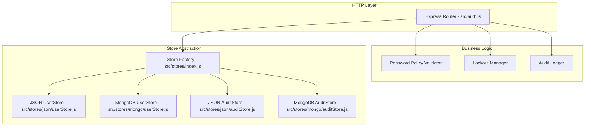

# Design Document: User Management

## Overview

The User Management module extends the existing Capillary Solution Agent with full user lifecycle management capabilities. It builds on the current authentication system (Passport.js SSO, bcrypt password hashing, express-session) and store abstraction layer (JSON-file and MongoDB backends) to add:

- Admin-driven user creation with one-time and permanent password types
- Forced password change on first login for one-time passwords
- Self-service password change for authenticated users
- Admin password reset with lockout clearing
- Password policy enforcement (min 8 chars, uppercase, lowercase, digit, special character)
- Account lockout after 5 consecutive failed login attempts (15-minute duration)
- Audit logging for all security-relevant events
- Extended user model with profile fields, lockout state, and password lifecycle tracking
- Role-based access control on all new endpoints

The design preserves full backward compatibility with the existing SSO flow, session management, and bootstrap admin mechanism.

## Architecture

The module follows the existing layered architecture:



### Key Design Decisions

1. **Extend `src/auth.js` with new routes** rather than creating a separate router. The existing auth router already handles user creation (`POST /api/auth/register`) and login. New endpoints for password change, password reset, user listing, user update, and user deletion are added to the same router to keep all auth/user concerns co-located.

2. **Pure-function business logic modules** for password policy validation and lockout checking. These are stateless functions that take inputs and return results, making them easy to test with property-based testing.

3. **Audit logging via a dedicated AuditStore** that follows the same store abstraction pattern (JSON-file and MongoDB backends). Audit entries are append-only and never modified.

4. **Backward-compatible user model migration** — existing user records missing new fields are treated with sensible defaults (failedLoginAttempts: 0, mustChangePassword: false, firstName: "", lastName: "", passwordType: null). No migration script needed.

5. **Middleware-based must-change-password enforcement** — a new middleware checks `mustChangePassword` on every request and restricts access to only the password change and logout endpoints until the user sets a new password.

## Components and Interfaces

### 1. Password Policy Validator (`src/passwordPolicy.js`)

A pure-function module that validates passwords against the policy.

```javascript
/**
 * Validates a password against the password policy.
 * @param {string} password - The password to validate
 * @returns {{ valid: boolean, violations: string[] }}
 */
export function validatePassword(password) { ... }
```

Policy rules:
- Minimum 8 characters
- At least one uppercase letter (`/[A-Z]/`)
- At least one lowercase letter (`/[a-z]/`)
- At least one digit (`/[0-9]/`)
- At least one special character (`/[^A-Za-z0-9]/`)

Returns `{ valid: true, violations: [] }` on success, or `{ valid: false, violations: ["Password must be at least 8 characters", ...] }` on failure.

### 2. Lockout Manager (`src/lockout.js`)

Pure functions for lockout state management.

```javascript
/**
 * Checks if a user account is currently locked.
 * @param {{ lockedUntil: string|null }} user
 * @param {Date} [now=new Date()]
 * @returns {{ locked: boolean, remainingMs: number }}
 */
export function isLocked(user, now = new Date()) { ... }

/**
 * Computes the new lockout state after a failed login attempt.
 * @param {{ failedLoginAttempts: number }} user
 * @param {{ threshold: number, durationMs: number }} config
 * @param {Date} [now=new Date()]
 * @returns {{ failedLoginAttempts: number, lockedUntil: string|null }}
 */
export function applyFailedAttempt(user, config, now = new Date()) { ... }

/**
 * Returns the reset state for a successful login or admin reset.
 * @returns {{ failedLoginAttempts: number, lockedUntil: null }}
 */
export function resetLockout() { ... }
```

Constants: `LOCKOUT_THRESHOLD = 5`, `LOCKOUT_DURATION_MS = 15 * 60 * 1000`.

### 3. Audit Logger (`src/auditLogger.js`)

Thin wrapper that writes structured audit entries to the AuditStore.

```javascript
/**
 * Logs a security event.
 * @param {{ event: string, actor: string, target?: string, details?: object }} entry
 * @returns {Promise<void>}
 */
export async function logAuditEvent({ event, actor, target, details }) { ... }
```

Event types: `USER_CREATED`, `PASSWORD_CHANGED`, `PASSWORD_RESET`, `LOGIN_FAILED`, `ACCOUNT_LOCKED`, `LOGIN_SUCCESS`.

### 4. Extended User Store Interface

New methods added to the UserStore interface (both JSON and MongoDB backends):

```javascript
// Existing
findUserByEmail(email)        → Promise<User|null>
createUser({ email, password, role, ... }) → Promise<User>
upsertSsoUser(email)          → Promise<User>

// New
findUserById(id)              → Promise<User|null>
listUsers()                   → Promise<User[]>
updateUser(id, fields)        → Promise<User|null>
deleteUser(id)                → Promise<boolean>
```

### 5. Audit Store Interface

New store module following the existing pattern:

```javascript
// src/stores/json/auditStore.js (and mongo equivalent)
init()                        → Promise<void>
appendEntry(entry)            → Promise<void>
listEntries(filter?)          → Promise<AuditEntry[]>
```

### 6. New API Endpoints (added to `src/auth.js`)

| Method | Path | Auth | Description |
|--------|------|------|-------------|
| POST | `/api/users` | Admin | Create user (replaces `/api/auth/register`) |
| GET | `/api/users` | Admin | List all users (excludes passwordHash) |
| GET | `/api/users/:id` | Admin | Get user profile (excludes passwordHash) |
| PUT | `/api/users/:id` | Admin | Update user profile (firstName, lastName, role) |
| DELETE | `/api/users/:id` | Admin | Delete user and invalidate sessions |
| POST | `/api/users/:id/reset-password` | Admin | Reset user password |
| POST | `/api/auth/change-password` | Authenticated | Change own password |

The existing `POST /api/auth/register` endpoint is preserved for backward compatibility but delegates to the new user creation logic.

### 7. Middleware: Must-Change-Password Guard

```javascript
/**
 * Middleware that blocks access to all endpoints except password change
 * and logout when the session indicates mustChangePassword.
 */
export function requirePasswordChange(req, res, next) { ... }
```

Inserted in the middleware chain after session setup, before the auth guard.

## Data Models

### Extended User Record

```json
{
  "id": "uuid",
  "firstName": "string",
  "lastName": "string",
  "email": "string",
  "passwordHash": "string|null",
  "role": "admin|user",
  "passwordType": "one-time|permanent|null",
  "mustChangePassword": "boolean",
  "failedLoginAttempts": "integer",
  "lockedUntil": "ISO timestamp|null",
  "createdAt": "ISO timestamp",
  "lastPasswordChange": "ISO timestamp|null",
  "createdBy": "string (admin email | 'system' | 'sso')"
}
```

**Backward compatibility**: Existing records missing new fields are treated with defaults:
- `firstName`: `""`
- `lastName`: `""`
- `passwordType`: `null`
- `mustChangePassword`: `false`
- `failedLoginAttempts`: `0`
- `lockedUntil`: `null`
- `lastPasswordChange`: `null`
- `createdBy`: `"system"`

### Audit Log Entry

```json
{
  "id": "uuid",
  "event": "USER_CREATED|PASSWORD_CHANGED|PASSWORD_RESET|LOGIN_FAILED|ACCOUNT_LOCKED|LOGIN_SUCCESS",
  "actor": "string (email of the user performing the action)",
  "target": "string|null (email of the affected user, if different from actor)",
  "details": "object|null (additional context)",
  "timestamp": "ISO timestamp"
}
```

### Session Extension

The session object gains one additional field:

```json
{
  "userId": "uuid",
  "email": "string",
  "role": "admin|user",
  "mustChangePassword": "boolean"
}
```

## Correctness Properties

*A property is a characteristic or behavior that should hold true across all valid executions of a system — essentially, a formal statement about what the system should do. Properties serve as the bridge between human-readable specifications and machine-verifiable correctness guarantees.*

### Property 1: Password hash round-trip

*For any* valid password string, hashing it with bcrypt (12 rounds) and then comparing the original password against the resulting hash using `bcrypt.compare` SHALL return `true`. This must hold whether the password is set during user creation, password change, or admin password reset.

**Validates: Requirements 1.4, 3.1, 3.3, 4.1, 13.1**

### Property 2: Password hash rejects different passwords

*For any* two distinct password strings `p1` and `p2`, hashing `p1` with bcrypt and then comparing `p2` against the resulting hash using `bcrypt.compare` SHALL return `false`.

**Validates: Requirements 13.2**

### Property 3: Password policy validation correctness

*For any* string, the password policy validator SHALL return `valid: true` if and only if the string is at least 8 characters long AND contains at least one uppercase letter, one lowercase letter, one digit, and one special character. The `violations` array SHALL list exactly the rules that are not met.

**Validates: Requirements 5.1, 5.2**

### Property 4: Password policy validation idempotence

*For any* string, calling `validatePassword` multiple times with the same input SHALL produce identical results (same `valid` boolean and same `violations` array).

**Validates: Requirements 13.3**

### Property 5: passwordType determines mustChangePassword flag

*For any* user creation or password reset with a `passwordType` value, the resulting `mustChangePassword` flag SHALL equal `true` when `passwordType` is `"one-time"` and `false` when `passwordType` is `"permanent"`.

**Validates: Requirements 1.2, 1.3, 4.2, 4.3**

### Property 6: Duplicate email rejection is case-insensitive

*For any* email string and any case transformation of that email, attempting to create a second user with the case-transformed email SHALL be rejected when a user with the original email already exists.

**Validates: Requirements 1.5**

### Property 7: User creation stores all required fields

*For any* valid user creation input (firstName, lastName, email, password, role, passwordType), the resulting stored user record SHALL contain all specified fields: id (valid UUID), firstName, lastName, email, passwordHash (non-null), role, passwordType, mustChangePassword, failedLoginAttempts (0), lockedUntil (null), createdAt (valid ISO timestamp), lastPasswordChange (null), and createdBy.

**Validates: Requirements 1.1, 12.1**

### Property 8: Lockout state determined by timestamp comparison

*For any* `lockedUntil` ISO timestamp and any reference time `now`, the `isLocked` function SHALL return `locked: true` when `lockedUntil` is in the future relative to `now`, and `locked: false` when `lockedUntil` is in the past or null.

**Validates: Requirements 6.3, 6.5**

### Property 9: Failed login counter increments monotonically

*For any* sequence of N consecutive failed login attempts on a user account (where N < lockout threshold), the `failedLoginAttempts` counter SHALL equal N.

**Validates: Requirements 6.1**

### Property 10: User listing and profile retrieval never expose passwordHash

*For any* set of users in the store, the user list endpoint and individual profile endpoint SHALL return user records that never contain the `passwordHash` field.

**Validates: Requirements 9.1, 9.2**

### Property 11: User profile update round-trip

*For any* valid update to a user's firstName, lastName, or role, reading the user record back after the update SHALL return the updated values.

**Validates: Requirements 9.3**

### Property 12: SSO users have null passwordHash and no forced password change

*For any* email address, creating or retrieving a user via `upsertSsoUser` SHALL result in a record with `passwordHash` set to `null` and `mustChangePassword` set to `false`.

**Validates: Requirements 11.2**

### Property 13: Invalid role values are rejected

*For any* string that is not `"admin"` or `"user"`, submitting it as the `role` field during user creation SHALL be rejected with a validation error.

**Validates: Requirements 1.7**

### Property 14: Empty or whitespace-only names are rejected

*For any* string that is empty or composed entirely of whitespace, submitting it as `firstName` or `lastName` during user creation SHALL be rejected with a validation error.

**Validates: Requirements 1.8**

## Error Handling

### HTTP Error Responses

All error responses follow a consistent JSON format:

```json
{ "error": "Descriptive error message" }
```

| Scenario | Status | Error Message |
|----------|--------|---------------|
| Missing required fields | 400 | `"firstName, lastName, email, password, and role are required"` |
| Password policy violation | 400 | `"Password policy violation: <specific violations>"` |
| Invalid role value | 400 | `"role must be 'user' or 'admin'"` |
| Empty firstName/lastName | 400 | `"firstName and lastName must be non-empty strings"` |
| Wrong current password | 401 | `"Current password is incorrect"` |
| Not authenticated | 401 | `"Not authenticated"` |
| Admin-only endpoint | 403 | `"Admin only"` |
| Must change password | 403 | `"Password change required before accessing this resource"` |
| User not found | 404 | `"User not found"` |
| Duplicate email | 409 | `"User already exists"` |
| Account locked | 423 | `"Account locked. Try again in X minutes"` |

### Internal Error Handling

- Store write failures are caught and logged; the HTTP layer returns 500 with a generic message.
- bcrypt errors (e.g., invalid hash format) are caught and treated as authentication failures.
- Audit logging failures are logged to console but do not block the primary operation (fire-and-forget pattern).

## Testing Strategy

### Property-Based Tests (fast-check + vitest)

The project already uses `fast-check` for property-based testing. Each correctness property maps to a property-based test.

**Configuration**: Minimum 100 iterations per property test, except for tests involving bcrypt hashing which use 20 iterations due to the intentional slowness of bcrypt (12 rounds). This matches the existing pattern in `userStore.prop.test.js`.

**Test files**:
- `src/__tests__/passwordPolicy.prop.test.js` — Properties 3, 4 (pure function, fast, 100+ runs)
- `src/__tests__/lockout.prop.test.js` — Property 8 (pure function, fast, 100+ runs)
- `src/__tests__/userManagement.prop.test.js` — Properties 1, 2, 5, 6, 7, 9, 10, 11, 12, 13, 14 (store-level, bcrypt-bound tests use 20 runs)

Each test is tagged with a comment referencing the design property:
```javascript
// Feature: user-management, Property 3: Password policy validation correctness
```

### Unit Tests (vitest)

Example-based tests for specific scenarios and integration points:

- `src/__tests__/userManagement.test.js`:
  - Login with one-time password returns mustChangePassword flag (2.1)
  - Login with permanent password establishes session (2.2)
  - Password change clears mustChangePassword and establishes session (2.4)
  - Password change resets failedLoginAttempts (3.4)
  - Admin reset clears lockout state (4.4)
  - Non-admin cannot access admin endpoints (1.6, 4.5, 8.3)
  - Lockout triggers after 5 failed attempts (6.2)
  - Successful login resets counter (6.4)
  - Delete user returns 404 for non-existent ID (9.5)
  - Backward compatibility with missing fields (12.2, 12.3)

### Integration Tests

- Audit logging: verify each event type is recorded with correct fields (7.1–7.7)
- SSO backward compatibility: verify upsertSsoUser flow unchanged (11.1, 11.3, 11.4)
- Backend compatibility: verify JSON and MongoDB backends expose same interface (10.1–10.5)

### Test Organization

Tests follow the existing project convention:
- All test files in `src/__tests__/`
- Property tests suffixed with `.prop.test.js`
- Unit tests suffixed with `.test.js`
- `beforeEach` resets store state via `_reset()`
- `afterAll` restores original data files

